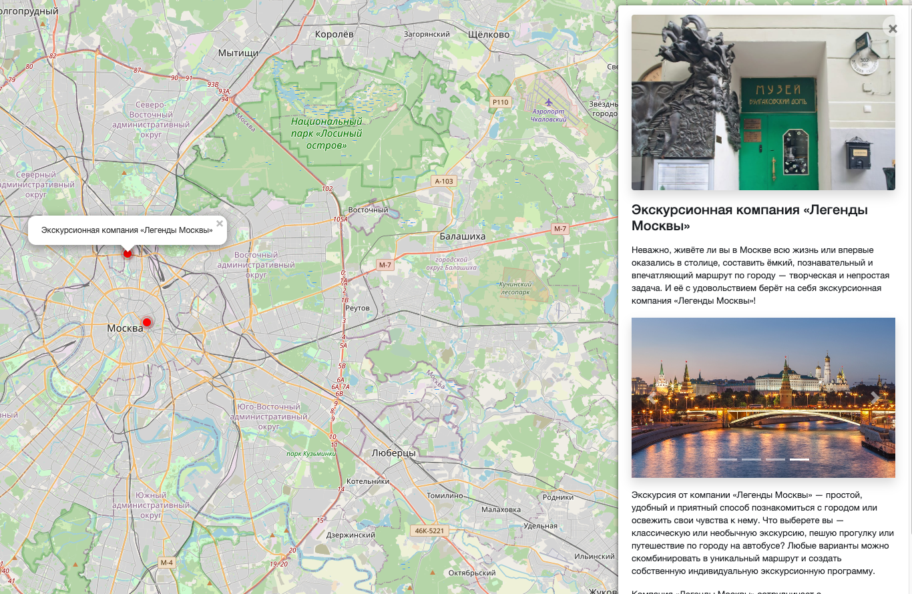

# Where to go 🐻
Website about intersting places in Moscow

## Running

- Install dependencies `pip install -r requirements.txt`
- Go to the folder `cd where-to-go` 
- initiate DB`python3 manage.py migrate`
- Run the server `python3 manage.py runserver`

## Environment variable

Please create the file `.env` in the same folder as `manage.py` and save variables there as : `VARIABLE=value`.

## What this about?

The code done for educational purposes — this is the lesson from [Devman](https://dvmn.org).